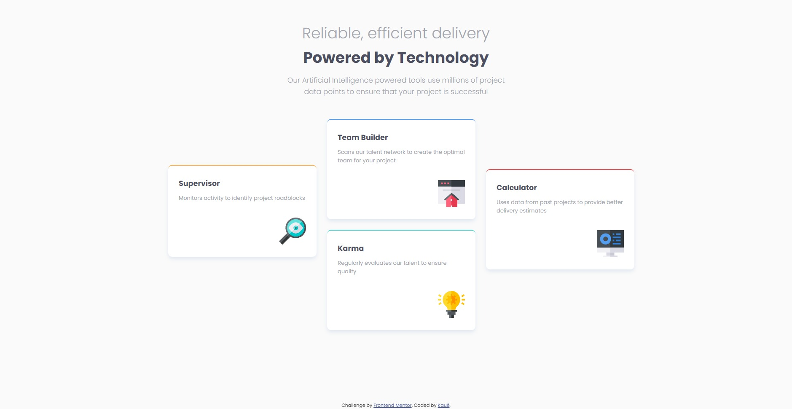

# Frontend Mentor - Four card feature section solution

This is a solution to the [Four card feature section challenge on Frontend Mentor](https://www.frontendmentor.io/challenges/four-card-feature-section-weK1eFYK). Frontend Mentor challenges help you improve your coding skills by building realistic projects. 

## Table of contents

  - [Screenshot](#screenshot)
  - [Links](#links)
  - [Built with](#built-with)
  - [Continued development](#continued-development)
  - [Author](#author)

### Screenshot

### Links

- Solution URL: [Click here](https://github.com/kauevecchia/four-card-feature-section)
- Live Site URL: [Click here](https://kauevecchia.github.io/four-card-feature-section/)

### Built with

- HTML5 
- CSS3
- Flexbox
- CSS Grid
- Mobile-first workflow

### Continued development

I want to continue improving on my grid, flexbox and responsiveness abilities.

## Author

- Website - [Click here](https://kauevecchia.github.io/four-card-feature-section/)
- Frontend Mentor - [@kauevecchia](https://www.frontendmentor.io/profile/kauevecchia)
